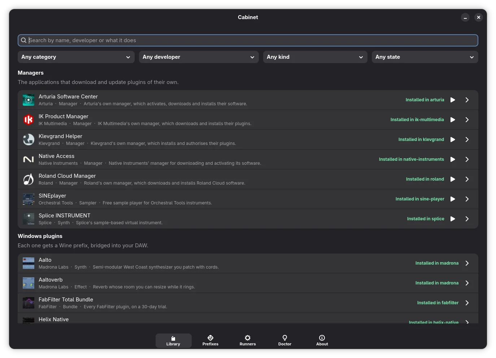

# Cabinet

Windows VST plugins on Linux as a Flatpak, aiming to work out of the box: install a plugin and it shows up in your DAW,
with no Wine or yabridge to set up. Plugins get **Wine prefixes of their own**, one per vendor or product family,
instead of a single prefix every installer fights over. Built for immutable systems like Fedora Silverblue. The bridging
is [yabridge](https://github.com/robbert-vdh/yabridge), with a few Cabinet patches, and the compatibility layer is
[Wine](https://www.winehq.org); Cabinet bundles both and wires the result to your DAW.



## Install

```sh
flatpak remote-add --if-not-exists cabinet \
  https://mark12870.github.io/cabinet/io.github.mark12870.cabinet.flatpakrepo
flatpak install cabinet io.github.mark12870.cabinet
```

**A DAW installed outside Flatpak needs nothing more.** Whatever Cabinet bridges lands in `~/.vst3/cabinet`,
`~/.clap/cabinet` and `~/.vst/cabinet`, which such a DAW already scans.

**A Flatpak DAW has to be enrolled first, once.** Its sandbox hides Cabinet's yabridge, your prefixes and the Wine that
runs them, so without this it sees no Windows plugins at all. Look up its id with `flatpak list --app`, then:

```sh
flatpak run io.github.mark12870.cabinet enrol fm.reaper.Reaper
```

or, in the window, *Doctor → Enrol a DAW*. It changes nothing: it **prints** a `flatpak override` for you to run (see
[Permissions](#permissions)) and a self-test for the DAW's runtime. Restart the DAW afterwards; if an update needs more
permissions, `sync`, the window and `doctor` say so, and `enrol` prints the new command.

Everything is in the window. For the command line, `flatpak run io.github.mark12870.cabinet --help` lists every command.

The Library installs without showing vendors' licences, so installing accepts their terms on your behalf; the window
and `library install` say whose before anything runs.

## Permissions

`enrol` prints the `flatpak override` rather than applying it, because one of the permissions it asks for is
`--talk-name=org.freedesktop.Flatpak`. That lets the shim start Cabinet's Wine from inside the DAW's sandbox — **and it
lets that DAW run any command on your host.** It also loads native plugins from `~/.vst*`, `~/.clap` and `~/.lv2`, which
the Windows code Cabinet runs can write to, unlike any other Flatpak app's data;
`flatpak override --user --reset <daw-id>` undoes it. `flatpak uninstall --delete-data` **will** delete your prefixes;
after any uninstall, remove `~/.vst*/cabinet` and `~/.clap/cabinet` yourself.

## Building

```sh
flatpak run org.flatpak.Builder --repo=repo --force-clean --default-branch=stable build io.github.mark12870.cabinet.yml
flatpak remote-add --user --if-not-exists --no-gpg-verify cabinet-local "file://$PWD/repo"
flatpak install --user --or-update cabinet-local io.github.mark12870.cabinet
```

## License

GPL-3.0-or-later, matching yabridge. See [LICENSE](LICENSE). The app icon combines the *dresser* and *piano-keys* icons
from [Phosphor Icons](https://phosphoricons.com), recoloured — MIT, see [data/LICENSE.phosphor](data/LICENSE.phosphor).
